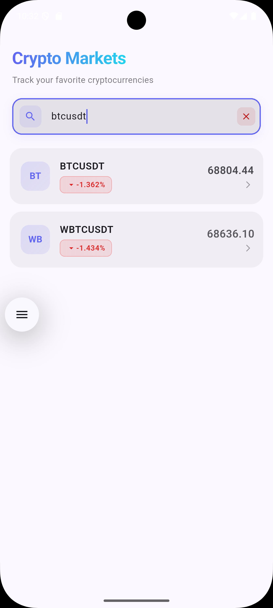
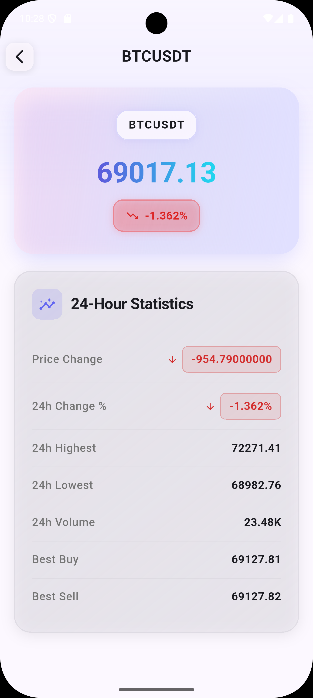

# Crypto Tracker

Binance kripto para piyasalarını gerçek zamanlı olarak izlemek için geliştirilmiş bir Flutter uygulaması. Tüm kripto para çiftlerini listeler, arama yapabilir, detaylı bilgi görüntüleyebilir ve WebSocket ile canlı fiyat güncellemelerini takip edebilirsiniz.

**Geliştirici**: Enver Tunaç Sonmez  
**Proje Adı**: Crypto Tracker (trade_app)  
**Platform**: Flutter (iOS, Android, Web, Windows, macOS, Linux)  
**Dart SDK**: ^3.9.2

---

## 📋 İçindekiler

- [Özellikler](#-özellikler)
- [Kurulum ve Çalıştırma](#-kurulum-ve-çalıştırma)
- [Mimari ve State Yönetimi](#-mimari-ve-state-yönetimi)
- [Dosya Yapısı](#-dosya-yapısı)
- [Teknik Kararlar ve Varsayımlar](#-teknik-kararlar-ve-varsayımlar)
- [Bağımlılıklar](#-bağımlılıklar)
- [Ekran Tanıtımları](#-ekran-tanıtımları)
- [API Kaynakları](#-api-kaynakları)
- [Geliştiriciler İçin](#-geliştiriciler-için)

---

## ✨ Özellikler

### Temel Fonksiyonaliteler
- **📊 Market Listesi**: Tüm Binance işlem çiftlerini görüntüle
  - Sembol, güncel fiyat, 24 saatlik fiyat değişimi (% ve $ olarak)
  - Sonsuz kaydırma ile dinamik yükleme (Her 30 item)
  - Refresh indicator ile manuel güncelleme

- **🔍 Gelişmiş Arama**: İşlem çifti sembolüne göre ara
  - Örn: "btc" yazılınca BTCUSDT, BTCBUSD vb. tüm BTC çiftlerini gösterir
  - Gerçek zamanlı filtreleme
  - Arama geçmişi temizleme

- **📈 Market Detay Sayfası**: Seçilen işlem çifti için ayrıntılı bilgiler
  - Güncel fiyat ve 24 saatlik değişim (animasyonlu gösterim)
  - En yüksek / En düşük fiyat
  - Toplam işlem hacmi
  - Bid / Ask fiyatları

### Gerçek Zamanlı Güncellemeler
- **⚡ WebSocket Entegrasyonu**: Binance WebSocket API ile canlı fiyat güncellemeleri
  - Tüm çiftler için toplu güncelleme (miniTicker stream)
  - 100ms throttle ile performans optimizasyonu
  - Ayrı liste ve detay ekranında çalışır

### Kullanıcı Deneyimi
- **🎨 Modern UI**: Material Design 3 ile geliştirilmiş
  - Indigo (#6366F1) ana rengi, Cyan (#22D3EE) ikincil rengi
  - Animasyonlu geçişler ve pulse efektleri
  - Responsive tasarım

- **⏳ Loading & Hata Yönetimi**: 
  - Shimmer loading indicator (veri yüklenirken)
  - Hata ekranı ve "Tekrar Dene" butonu
  - Boş sonuç mesajları
  - Try-catch mekanizması ile kapsamlı hata işleme

---

## 🚀 Kurulum ve Çalıştırma

### Sistem Gereksinimleri
- **Flutter**: ^3.5.0 (veya daha yeni)
- **Dart**: ^3.9.2
- **Bağımlılıklar**: pubspec.yaml dosyasında belirtilmiştir

### Adım 1: Projeyi Klonla
```bash
git clone https://github.com/envertunasonmez/Crypto-Tracker-.git
cd crypto_tracker
```

### Adım 2: Bağımlılıkları Yükle
```bash
flutter pub get
```

### Adım 3: Uygulamayı Çalıştır

**Spesifik cihazda çalıştırma:**
```bash
# iOS simülatöründe
flutter run -d ios

# Android emülatöründe
flutter run -d android

# Web tarayıcısında
flutter run -d web

# Tüm mevcut cihazları listele
flutter devices

# Release modda çalıştır (daha performanslı)
flutter run --release
```

### Adım 4: Kod Kalitesini Doğrula

```bash
# Statik analiz çalıştır (linter kontrol)
flutter analyze

# Otomatik düzeltilebilir sorunları düzelt
dart fix --apply

# Kodu biçimlendir
dart format .
```

---

## 🏗️ Mimari ve State Yönetimi

### Mimari Deseni: MVVM + Repository Pattern

```
┌─────────────────────────────────────────┐
│  Presentation Layer                     │
│  (UI - Screens, Widgets, Providers)     │
└────────────┬────────────────────────────┘
             │ Observer Pattern (Provider)
┌────────────▼────────────────────────────┐
│  Domain Layer (Business Logic)          │
│  (Providers, State Management)          │
└────────────┬────────────────────────────┘
             │ Repository Interface
┌────────────▼────────────────────────────┐
│  Data Layer                             │
│  (API, WebSocket, Models)               │
└─────────────────────────────────────────┘
```

### State Management: Provider Pattern

**MarketProvider** (lib/features/market/presentation/providers/market_provider.dart):
- ChangeNotifier kullanarak state yönetimi
- 4 durumu (MarketState): initial, loading, success, error
- WebSocket dinleyici (listener) için throttling mekanizması
- Arama sorgusu filtreleme

### Repository Pattern

**MarketRepository** (lib/features/market/data/repositories/market_repository.dart):
- API ve WebSocket datasourcelerini soyutlar
- Veri katmanını sunar

---

## 📁 Dosya Yapısı

```
lib/
├── main.dart
├── core/
│   ├── config/
│   │   └── api_config.dart
│   ├── utils/
│   │   └── format_utils.dart
│   └── widgets/
│       ├── empty_view.dart
│       ├── error_view.dart
│       └── shimmer_loading.dart
└── features/
    └── market/
        ├── data/
        │   ├── datasources/
        │   │   ├── market_api_datasource.dart
        │   │   └── market_websocket_datasource.dart
        │   ├── models/
        │   │   └── ticker.dart
        │   └── repositories/
        │       └── market_repository.dart
        └── presentation/
            ├── providers/
            │   └── market_provider.dart
            └── screens/
                ├── market_list/
                │   ├── market_list_screen.dart
                │   └── widgets/
                └── market_detail/
                    ├── market_detail_screen.dart
                    └── widgets/
```

### Klasör Açıklamaları

| Klasör | Amaç |
|--------|------|
| lib/core/ | Tüm özellikler tarafından kullanılan ortak kod (config, utils, widgetlar) |
| lib/features/market/data/ | Veri işleme katmanı (API, WebSocket, Modeller, Repository) |
| lib/features/market/presentation/ | UI katmanı (Providers, Ekranlar, Widgetlar) |

---

## 💡 Teknik Kararlar ve Varsayımlar

### 1. REST API Tasarımı
**Karar**: Binance Public API (`/api/v3/ticker/24hr`) kullanılmıştır
- ✅ API key gerekmez, herkese açık
- ✅ Tüm işlem çiftlerinin 24 saatlik verilerini alır
- ⚠️ Yüksek bandwidth kullanımı, rate limiting
- **URL**: https://api.binance.com/api/v3/ticker/24hr

### 2. WebSocket Entegrasyonu
**Karar**: `!miniTicker@arr` stream kullanılmıştır
- ✅ Tüm çiftler için toplu güncellemeler (daha verimli)
- ✅ REST API'den aldığımız verileri güncellemek için mükemmel
- ✅ Düşük bant genişliği ve yüksek frekans
- **URL**: wss://stream.binance.com:9443/ws/!miniTicker@arr

### 3. Throttling Mekanizması
- WebSocket güncellemelerinde 100ms throttle
- Sebep: Her WebSocket mesajı için notifyListeners() çağrısı pahalı
- Sonuç: Maksimum 10 UI güncellemesi/saniye (verimli rendering)

### 4. Veri Filtreleme
- Volume veya lastPrice'ı 0 olan semboller listeden çıkarılır
- Amaç: Kullanıcıya yalnızca aktif işlem çiftlerini göster

### 5. Sonsuz Kaydırma (Pagination)
- İlk yüklemede 30 item, sonra 30'ar 30 ekle
- Sebep: Tüm 3000+ çifti birdire yüklememek (performans)
- Avantajı: Hızlı ilk yükleme, optimize edilmiş bellek kullanımı

### 6. Animasyonlar
- Liste öğeleri: Scale + Fade animasyonu (280ms)
- Fiyat güncellemeleri: Pulse animasyonu (300ms)
- Detay ekranı: Staggered animasyonlar

---

## 📦 Bağımlılıklar

### Ana Bağımlılıklar

| Paket | Versiyon | Kullanım |
|-------|----------|----------|
| **provider** | ^6.1.2 | State management (ChangeNotifier) |
| **http** | ^1.2.2 | REST API istekleri (Binance Ticker24hr) |
| **web_socket_channel** | ^3.0.1 | WebSocket bağlantısı (gerçek zamanlı güncellemeler) |
| **shared_preferences** | ^2.5.4 | Yerel veri depolama |
| **cupertino_icons** | ^1.0.8 | iOS stil ikonları |
| **flutter_lints** | ^5.0.0 | Kod kalitesi ve stil kuralları |

### Kurulum
```bash
flutter pub get
```

---

## 🖼️ Ekran Tanıtımları

| Market Liste | Arama | Detay Ekranı |
|---|---|---|
|  |  |  |

### 1. Market Liste Ekranı (MarketListScreen)

**Dosya**: lib/features/market/presentation/screens/market_list/market_list_screen.dart

**Bileşenler:**
- Başlık: "Crypto Markets" (ShaderMask gradyan efekti)
- Arama Çubuğu: İşlem çifti sembolüne göre canlı filtreleme
- Liste: CustomScrollView + SliverList (performans)
  - MarketListItem: Symbol, Fiyat, % Değişim (renk kodlu)
  - Pulse animasyonu (fiyat güncellemesi sırasında)
  - Pull-to-refresh ve sonsuz kaydırma

**Durumlar:**
- Loading: Shimmer loading skeleton
- Error: Hata mesajı ve "Tekrar Dene" butonu
- Success: Tickers listesi
- Empty: "Veri bulunamadı" mesajı

### 2. Arama Ekranı (Search)

**Özellikler:**
- Gerçek zamanlı sembol arama
- Bağlamsal filtreleme (örn: "btc" yazılınca BTCUSDT, BTCBUSD vb. göster)
- Arama geçmişi yönetimi
- Hızlı sonuç listesi

### 3. Market Detay Ekranı (MarketDetailScreen)

**Dosya**: lib/features/market/presentation/screens/market_detail/market_detail_screen.dart

**Bileşenler:**
- AppBar: Transparan arka plan, sembol başlığı, geri butonu
- Market Fiyat Kartı:
  - Gradyan animasyonu (3 saniye döngü)
  - Güncel fiyat (büyük yazı tipi)
  - 24h Fiyat değişimi (% ve $)
  - Renk kodlu badge (yeşil/kırmızı)
- Detaylar Kartı (Staggered animasyonlar):
  - En Yüksek Fiyat
  - En Düşük Fiyat
  - Toplam Hacim
  - Bid Fiyatı
  - Ask Fiyatı
  - Bid-Ask Aralığı
  - Sembol

### 4. Loading Durumu (Shimmer)
**Dosya**: lib/core/widgets/shimmer_loading.dart
- Gri placeholder kartlar
- 1.5 saniye shimmer animasyonu

### 4. Hata Durumu
**Dosya**: lib/core/widgets/error_view.dart
- Hata ikonu
- Hata mesajı
- "Tekrar Dene" butonu

---

## 🔗 API Kaynakları

### Binance REST API
**Endpoint**: GET /api/v3/ticker/24hr
**Base URL**: https://api.binance.com/api/v3

### Binance WebSocket API
**Stream**: !miniTicker@arr
**Base URL**: wss://stream.binance.com:9443/ws

**Belgeler**: [Binance Spot API Docs](https://binance-docs.github.io/apidocs/spot/en/)

---

## 👨‍💻 Geliştiriciler İçin

### Kod Kalitesi Standartları
Proje `analysis_options.yaml` ile yapılandırılmıştır:
- prefer_single_quotes
- prefer_const_constructors
- avoid_print
- avoid_unnecessary_containers
- use_build_context_synchronously
- sort_child_properties_last

### İyi Uygulamalar
1. **const Constructor Kullan**
2. **Tek Tırnakları Kullan**
3. **Null Safety**: String? vs String
4. **Provider ile State Yönetimi**
   - context.read<MarketProvider>()
   - Consumer<MarketProvider>()

### Yeni Feature Ekleme
1. Klasör Yapısı: data/ + presentation/
2. Model Sınıfı: fromJson() + copyWith()
3. Datasource: Abstract + Implementation
4. Repository: Abstract + Implementation
5. Provider: ChangeNotifier extend
6. Screens: StatefulWidget + Consumer

### Test ve Hata Ayıklama
```bash
flutter test
flutter test test/widget_test.dart
flutter pub global activate devtools
devtools
```

### Performans İpuçları
1. const Constructors: İmmutable widget'lar const yap
2. ListView→SliverList: Büyük listeler için SliverList kullan
3. Throttling: WebSocket güncellemeleri için throttle uygula
4. Lazy Loading: Tüm verileri bir seferde yükleme (pagination)
5. Provider Listen: Sadece gerekli state'i dinle

---

## 🐛 Hata Giderme

| Hata | Çözüm |
|------|-------|
| Connection refused | Binance API'si kapalı olabilir, İnterneti kontrol et |
| WebSocket connection failed | WSS bağlantısı başarısız, firewall kontrol et |
| Null pointer exception | null-safety kontrol et |
| ListTile overflow | Sütun genişliğini Expanded ile ayarla |

---

## 📄 Lisans
Bu proje açık kaynaktır.

---

## 📞 İletişim ve Destek
- **Sorunlar**: GitHub Issues üzerinde bildir

